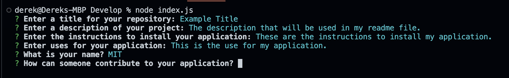
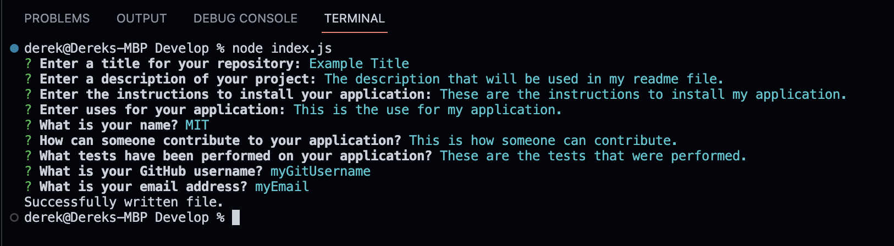
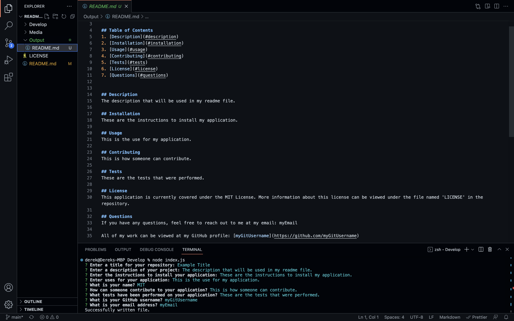

# README Generator

## Table of Contents
1. [Description](#description)
2. [Installation](#installation)
3. [Usage](#usage)
4. [Contributing](#contributing)
5. [Tests](#tests)
6. [License](#license)
7. [Questions](#questions)
8. [Media](#media)

## Description
This application serves as a command prompt tool to quickly generate a quality README.md file based off of prompted user inputs. The generated README.md file will be placed in the directory labeled 'Output'.

The application makes use of the npm Inquirer@8.2.4 package.

## Installation
After cloning the repo to your machine, use the integrated terminal to run 'npm i' to install the necessary dependencies. Once the dependencies are installed, you have what you need to run the application.

## Usage
Quickly generate README.md files for your GitHub Repository.

## Contributing
This application is open source. Anyone that wishes to use or make improvements on the code may do so.

## Tests
At this time, a test suite was not used on this application.

## License
This application is currently covered under the MIT License. More information about this license can be viewed under the file named 'LICENSE' in the repository.

## Questions
If you have any questions, feel free to reach out to me at my email: djohncaldwell@gmail.com

All of my work can be viewed at my GitHub profile: [CaldwellDerek](https://github.com/CaldwellDerek)

## Media

### Screenshots
Using 'node index.js' to initiate the application:

Proceeding through the prompts:

Finishing the prompts:

The resulting product - a README.md file is created in the 'Output' directory.
